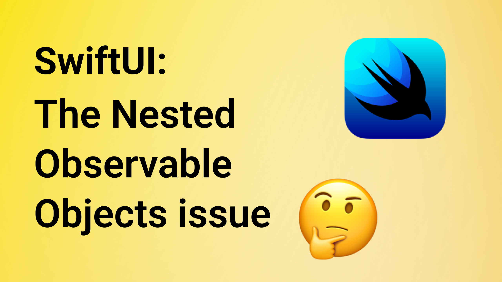

# How to solve nested Observable Objects issue

This is the code from the YT video "How to solve nested Observable Objects issue" 🤗

In this video, you will learn how to fix the nested Observable Object issue in SwiftUI. If you have ever had an issue with SwiftUI's view not updating, this one may be for you. Enjoy 🤓

## Links:
- [Link to the video](https://www.youtube.com/watch?v=L4bhf6y9dIA)